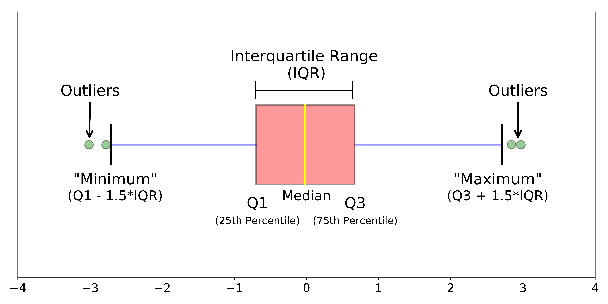
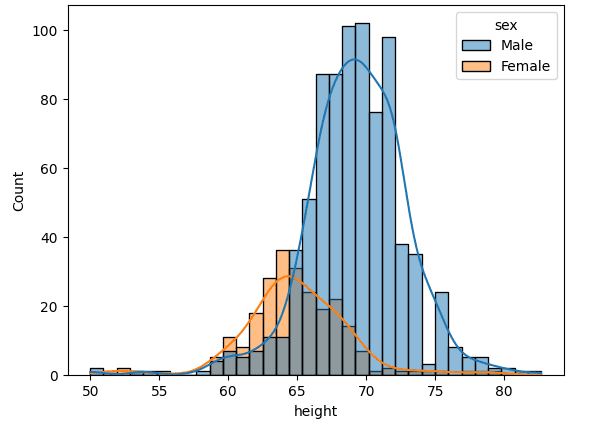
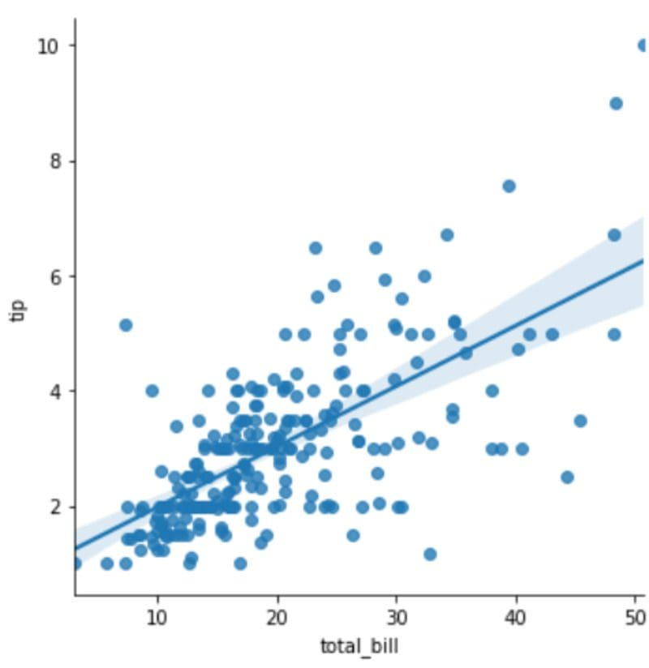

# Exploratory Data Analysis (EDA) Learning Journey

This repository is my learning playground for mastering **Exploratory Data Analysis (EDA)**. It documents my progress, experiments, and insights as I dive deep into the world of data.

## What is EDA?

EDA is a form of a step/approach which is used to analyze datasets so that we can get some insights out of it (visuals) and to obtain confidence in a data to an extent where we are ready to engage a machine learning model.

EDA helps us in finding the errors, dscovering data, mapping out data structure and finding out anomalies

---

## Visualization
visualization is the presentation of the data in the graphical or visual form to understand the data more clearly.
- Easily understand the features of the data
- Easily analyze the data and summarize it
- Help to get meaningful insights from the data
- Help to find the trend or pattern of the data

---

## Steps involved in EDA
### 1. Data Sourcing:
- The process of gathering data from multiple sources as external or internal data collection
     There are two major kind of data which can be classified according to the source:
     1. **Public data:** Easily accessible, data made public for the purpose of research
     2. **Private data:** Data which is not available on public platform

### 2. Data Cleaning:
- The process of cleaning the data to improve the quality of the data for further data analysis and building a machine learning model. The benifit of data cleaning is that all irrelevent data is gone, and we get the good quality of data which will help in improving the accuracy of our ML model.
    - Handling missing values
    - Standardization of the data
    - Outlier treatment
    - Handle invalid values

#### Handling missing values
- Delete rows/columns: commonly used to handle missing values. Rows can be deleted if it has insignificant number of missing values. Columns can be deleted if it has more than 75% of missing values (no thumb rule)
- Replacing with mean/median/mode: can be used on independent numerical variables. categorical features can be imputed with mode.
- Algorithm imputation: Some ML algorithm supports to handle missing values in the dataset. Like KNN, Naive Bayes, Random forest.
- Predicting the missing values: Prediction model is one of the advanced method to handle missing values. In this method, dataset with no missing value become training set and dataset with missing value becomes the test set and the missing value is treated as target variable

### 3. Feature Scaling:
- The method to rescale the values present in the features. In feature scaling, we convert the scale of different measurement into a single scale. It stndardizes the whole dataset in one range
- When we are dealing with independent variables or features that differ from each other in terms of range of values or units of the features, then we have to normalize/standardize the data so that the difference of values doesn't affect the outcome of the data

#### Standardization:
Standard scaler ensures that each of the feature, the mean is 0 and the standard deviation is 1, bringing all the features to the same magnitude. (Standardization helps you to scale down your feature based on the stndard normal distribution)

#### Min-Max Scaler:
Helps you to scale down your features between a range 0 to 1

### 4. Outlier Treatment:
Outliers are the most extreme values in the data. It is an abnormal observation that deviate from the norm. Outliers do not fit in the normal behaviour of the data. (Anomalies)

#### Detecting Outliers
1. Boxplot

2. Histogram

3. Scatter Plot

4. Z-Score
5. Inter quartile range (values out of 1.5 time of IQR)

---

## Topics Covered
- [**Data Collection & Loading**](./Data_Collection_&_Loading.ipynb): Gather and load data from various sources.
- [**Data Cleaning**](./Data_Cleaning.ipynb): Handle missing values and duplicates effectively.
- [**Feature Scaling**](./Feature_Scaling.ipynb): Stndardization and normalization of numerical data
---

## Topics Not Yet Covered
- **Data Transformation**: Normalize, encode, and transform data for analysis.
- **Data Visualization**: Create visualizations to spot trends and patterns.
- **Descriptive Statistics**: Summarize data using measures like mean, median, etc.
- **Detecting Patterns**: Identify relationships and emerging trends.
- **Handling Outliers**: Methods to identify and address outliers.
- **Correlation Analysis**: Explore feature dependencies and relationships.
- **Initial Modeling**: Experiment with simple models and hypotheses.

---

Feel free to explore, experiment, and learn! 😊

